# CAN

## Overview

The CAN subsystem has two layers:

1. **Generated definitions**: structs and macros auto-generated from the DBC file. These define CAN message structures, IDs, and scaling factors.
2. **Generic CAN driver**: hardware-agnostic driver handling TX scheduling, TX queuing, and RX ring buffering. Interfaced to HAL via function pointers provided at initialization.

Each board project provides two files to integrate the driver:
- **`can_driver.c`**: allocates buffers, configures TX frame slots, sets up HAL callbacks, and initializes the generic driver.
- **`can_comm.c`**: contains the RX message handler (`process_can_frames`) and the TX payload packer (`set_can_frames`).

> [!TIP]
> See the [CAN Integration Guide](/shared/common/modules/drivers/can-integration) for a step-by-step walkthrough of setting this up on a new board using ECU examples.

---

## Generated Definitions

Generated from `MAIN_DBC.dbc` by `dbc_to_c_builder.py`.

- **`can_signal_defs.h`**: per-message structs, message IDs, DLC constants, and signal scaling factor macros.
- **`can_board_defs.h`**: groups messages by sender board into convenience structs.

> [!WARNING]
> Do not edit the generated headers by hand. Re-run `dbc_to_c_builder.py` instead.

```c
#include "can_signal_defs.h"
#include "can_board_defs.h"

can_msg_GF_Wheel_Sensors_t gf = {0};
can_board_ECU_t ecu = {0};

gf.Wheel_Speed_FR = 1200;
ecu.ECU_Inverter_Sig.Calculated_Speed = 42.0f;
```

---

## Generic CAN Driver

### Architecture and Execution Flow

The driver manages two ring buffers and a periodic scheduler:

```
ISR context                          Main loop context
─────────────                        ──────────────────
HAL RX interrupt                     CAN_send_frames()
  └─► CAN_driver_rx_callback()         └─► enqueues due periodic frames
        └─► writes to RX ring buf          into the TX ring buffer

                                     CAN_process_tx_queue()
                                       └─► drains TX ring buffer
                                            into HW FIFO via add_to_fifo_fn()

                                     process_can_frames()  [board code]
                                       └─► reads from RX ring buffer
                                            via head/tail iteration
```

**TX scheduling**: Each TX frame slot specifies a `scheduler_timer_value` in ms. `CAN_send_frames()` checks which frames are due and enqueues them. Frames marked `CAN_DRIVER_NON_PERIODIC_FRAME` are skipped by the scheduler and sent manually via `CAN_send_single_frame()`.

**TX deduplication**: If a frame with a matching CAN ID is already queued in the software ring buffer, the driver overwrites it with the newest frame payload instead of appending.

**RX flow**: The ISR callback writes incoming frames into the RX ring buffer. `process_can_frames()` in the main loop reads them out by iterating from `tail` to `head`.

> [!NOTE]
> The driver uses `void*` for the HAL handle and TX headers to remain hardware-agnostic. Cast to platform-specific types (e.g., `FDCAN_HandleTypeDef*`) inside `can_driver.c`.

### Key Types

| Type | Purpose |
|------|---------|
| `CAN_Driver_t` | Main driver instance holding buffer pointers, frame configs, and HAL function pointers |
| `CAN_Tx_Message_Frame_t` | TX frame slot configuration (ID, payload, scheduler timer, HAL header pointer) |
| `CAN_Rx_Message_Frame_t` | RX frame structure (ID, payload, timestamp) |
| `CAN_Tx_Ring_Buffer_t` | Circular buffer for queued TX frames |
| `CAN_Rx_Ring_Buffer_t` | Circular buffer for received RX frames |

### Utility Macros

```c
LOW_BYTE(x)                  // Extract bits [7:0]
HIGH_BYTE(x)                 // Extract bits [15:8]
CAN_COMBINE_16(high, low)    // Reconstruct uint16 from two bytes
CAN_COMBINE_32(b3,b2,b1,b0) // Reconstruct uint32 from four bytes
CAN_DRIVER_NON_PERIODIC_FRAME // Scheduler ignore flag for manual transmission
```

---

## API Reference

#### `void CAN_set_structures(driver, add_to_fifo_fn, get_tx_fifo_level_fn, hfdcan_instance)`

Initializes internal indices and sets up function pointers. Must be called after configuring `tx_message_frames`, `rx_ring_buffer`, and `tx_ring_buffer` pointers and sizes.

| Parameter | Description |
|-----------|-------------|
| `driver` | `CAN_Driver_t*` pointer to driver instance |
| `add_to_fifo_fn` | `CanTxFn_t` HAL callback to push frame into HW FIFO (e.g. `HAL_FDCAN_AddMessageToTxFifoQ`) |
| `get_tx_fifo_level_fn` | `CanTxFifoLevelFn_t` HAL callback to check free space in HW TX FIFO |
| `hfdcan_instance` | `void*` pointer to peripheral HAL handle |

#### `void CAN_driver_rx_callback(driver, data, hdr_rx, msg_id, num_values, timestamp)`

ISR-safe callback. Pushes incoming frame into the RX ring buffer and sets `can_new_message_flag`. Call from peripheral RX interrupt (e.g. `HAL_FDCAN_RxFifo0Callback`).

> [!WARNING]
> Runs in interrupt context. Do not perform complex processing inside this function.

| Parameter | Description |
|-----------|-------------|
| `data` | `uint8_t*` received payload buffer |
| `hdr_rx` | `void*` RX header handle |
| `msg_id` | CAN message ID |
| `num_values` | Data length in bytes |
| `timestamp` | System tick timestamp (`HAL_GetTick()`) |

#### `void CAN_send_frames(driver, current_tick)`

Checks all registered periodic TX frame slots and enqueues due frames into the TX ring buffer. Call from main loop context.

Rotates starting index on each call to prevent fixed-priority scheduling bias.

#### `uint16_t CAN_process_tx_queue(driver, amount)`

Pushes queued frames from the software TX ring buffer to the hardware FIFO until FIFO is full or `amount` frames are processed (pass `0` to process all queued frames).

Returns the number of frames transmitted to the hardware FIFO.

#### `uint32_t CAN_send_single_frame(driver, frame)`

Enqueues a non-periodic frame into the TX ring buffer for transmission.

Returns `0` on success, `1` if the TX ring buffer is full.

```c
if (CAN_send_single_frame(&can_driver, &frame) != 0) {
    CAN_process_tx_queue(&can_driver, 5);
    CAN_send_single_frame(&can_driver, &frame);
}
```

---

## Internal Flow Diagram

```mermaid
%%{init: {
  'theme': 'dark',
  'themeVariables': {
    'fontSize': '14px',
    'fontFamily': 'system-ui, sans-serif'
  },
  'flowchart': {
    'nodeSpacing': 30,
    'rankSpacing': 40,
    'padding': 15,
    'curve': 'basis'
  }
}}%%
flowchart TB
    classDef initStyle fill:#1e293b,stroke:#3b82f6,stroke-width:2px,color:#fff;
    classDef rxStyle fill:#2e1065,stroke:#a855f7,stroke-width:2px,color:#fff;
    classDef txStyle fill:#064e3b,stroke:#10b981,stroke-width:2px,color:#fff;
    classDef fifoStyle fill:#431407,stroke:#f97316,stroke-width:2px,color:#fff;
    classDef singleStyle fill:#451a03,stroke:#eab308,stroke-width:2px,color:#fff;
    classDef helperStyle fill:#1e293b,stroke:#64748b,stroke-width:2px,color:#fff;
    classDef dlcStyle fill:#083344,stroke:#06b6d4,stroke-width:2px,color:#fff;

    classDef startNode fill:#1d4ed8,stroke:#3b82f6,stroke-width:1px,color:#fff;
    classDef decisionNode fill:#c2410c,stroke:#ea580c,stroke-width:1px,color:#fff;
    classDef errorNode fill:#991b1b,stroke:#ef4444,stroke-width:1px,color:#fff;
    classDef actionNode fill:#1e293b,stroke:#475569,stroke-width:1px,color:#fff;
    classDef successNode fill:#065f46,stroke:#10b981,stroke-width:1px,color:#fff;
    classDef rxActionNode fill:#581c87,stroke:#8b5cf6,stroke-width:1px,color:#fff;
    classDef txActionNode fill:#065f46,stroke:#10b981,stroke-width:1px,color:#fff;
    classDef fifoActionNode fill:#7c2d12,stroke:#f97316,stroke-width:1px,color:#fff;
    classDef singleActionNode fill:#78350f,stroke:#f59e0b,stroke-width:1px,color:#fff;
    classDef helperActionNode fill:#334155,stroke:#64748b,stroke-width:1px,color:#fff;

    subgraph Initialization ["Initialization Path"]
        direction TB
        init_start(["CAN_set_structures called"]):::startNode
        init_check{"Driver or buffers null?"}:::decisionNode
        init_ret(["Return early"]):::errorNode
        init_store["Store buffer pointers"]:::actionNode
        init_indices["Initialize head and tail indices"]:::actionNode
        init_clear["Clear new message flag"]:::actionNode
        init_done(["Initialization complete"]):::successNode

        init_start --> init_check
        init_check -- Yes --> init_ret
        init_check -- No --> init_store
        init_store --> init_indices
        init_indices --> init_clear
        init_clear --> init_done
    end

    subgraph RX_Interrupt ["RX Interrupt Path"]
        direction TB
        rx_start(["RX callback triggered"]):::startNode
        rx_check{"Driver null?"}:::decisionNode
        rx_ret(["RX return early"]):::errorNode
        rx_len{"Payload length valid?"}:::decisionNode
        rx_drop_len(["Drop invalid payload"]):::errorNode
        rx_full{"RX buffer full?"}:::decisionNode
        rx_drop_full(["Drop frame overflow"]):::errorNode
        rx_dlc["Convert DLC to payload size"]:::rxActionNode
        rx_copy["Copy frame to RX ring buffer"]:::rxActionNode
        rx_inc["Increment RX head index"]:::rxActionNode
        rx_flag["Set new message flag"]:::rxActionNode
        rx_done(["RX complete"]):::successNode

        rx_start --> rx_check
        rx_check -- Yes --> rx_ret
        rx_check -- No --> rx_len
        rx_len -- No --> rx_drop_len
        rx_len -- Yes --> rx_full
        rx_full -- Yes --> rx_drop_full
        rx_full -- No --> rx_dlc
        rx_dlc --> rx_copy
        rx_copy --> rx_inc
        rx_inc --> rx_flag
        rx_flag --> rx_done
    end

    subgraph Periodic_TX ["Periodic TX Scheduler"]
        direction TB
        sched_start(["CAN_send_frames called"]):::startNode
        sched_check{"TX driver null?"}:::decisionNode
        sched_ret(["TX return early"]):::errorNode
        sched_loop["Iterate frame configs"]:::txActionNode
        sched_non_periodic{"Frame non periodic?"}:::decisionNode
        sched_skip["Skip frame"]:::helperActionNode
        sched_due{"Frame due this tick?"}:::decisionNode
        sched_enqueue["Enqueue TX frame"]:::txActionNode
        sched_update["Update scheduler timer"]:::txActionNode
        sched_more{"More frames?"}:::decisionNode
        sched_flush["Flush TX ring buffer"]:::txActionNode
        sched_done(["Periodic TX complete"]):::successNode

        sched_start --> sched_check
        sched_check -- Yes --> sched_ret
        sched_check -- No --> sched_loop
        sched_loop --> sched_non_periodic
        sched_non_periodic -- Yes --> sched_skip
        sched_non_periodic -- No --> sched_due
        sched_due -- No --> sched_skip
        sched_due -- Yes --> sched_enqueue
        sched_enqueue --> sched_update
        sched_update --> sched_more
        sched_skip --> sched_more
        sched_more -- Yes --> sched_loop
        sched_more -- No --> sched_flush
        sched_flush --> sched_done
    end

    subgraph TX_FIFO_Empty ["TX FIFO Empty Path"]
        direction TB
        fifo_start(["TX FIFO empty callback"]):::startNode
        fifo_check{"FIFO driver null?"}:::decisionNode
        fifo_ret(["FIFO return early"]):::errorNode
        fifo_flush["Call flush TX ring buffer"]:::fifoActionNode
        fifo_done(["FIFO callback complete"]):::successNode

        fifo_start --> fifo_check
        fifo_check -- Yes --> fifo_ret
        fifo_check -- No --> fifo_flush
        fifo_flush --> fifo_done
    end

    subgraph Single_Frame ["Single Frame Path"]
        direction TB
        single_start(["CAN_send_single_frame called"]):::startNode
        single_check{"Single driver null?"}:::decisionNode
        single_ret(["Single return early"]):::errorNode
        single_enqueue["Enqueue single frame"]:::singleActionNode
        single_flush["Flush after enqueue"]:::singleActionNode
        single_done(["Single frame complete"]):::successNode

        single_start --> single_check
        single_check -- Yes --> single_ret
        single_check -- No --> single_enqueue
        single_enqueue --> single_flush
        single_flush --> single_done
    end

    subgraph Helpers ["Shared Internal Helpers"]
        direction TB
        subgraph Enqueue_Helper ["Enqueue TX Frame Helper"]
            direction TB
            enq_start(["Enqueue TX frame helper"]):::startNode
            enq_check{"TX buffer full?"}:::decisionNode
            enq_drop(["Drop frame buffer full"]):::errorNode
            enq_dlc["Convert payload size to DLC"]:::helperActionNode
            enq_copy["Copy frame to TX ring buffer"]:::helperActionNode
            enq_inc["Increment TX head index"]:::helperActionNode
            enq_done(["Enqueue complete"]):::successNode

            enq_start --> enq_check
            enq_check -- Yes --> enq_drop
            enq_check -- No --> enq_dlc
            enq_dlc --> enq_copy
            enq_copy --> enq_inc
            enq_inc --> enq_done
        end

        subgraph Flush_Helper ["Flush TX Ring Buffer Helper"]
            direction TB
            flush_start(["Flush TX ring buffer helper"]):::startNode
            flush_check{"TX buffer empty?"}:::decisionNode
            flush_none(["Nothing to flush"]):::helperActionNode
            flush_fifo["Check FIFO free level"]:::helperActionNode
            flush_fifo_space{"FIFO has space?"}:::decisionNode
            flush_wait(["Wait for FIFO"]):::helperActionNode
            flush_cb["Call add to FIFO callback"]:::helperActionNode
            flush_success{"Add to FIFO success?"}:::decisionNode
            flush_inc["Increment TX tail index"]:::helperActionNode
            flush_fail(["Add failed retry later"]):::errorNode
            flush_more{"More frames to flush?"}:::decisionNode
            flush_done(["Flush complete"]):::successNode

            flush_start --> flush_check
            flush_check -- Yes --> flush_none
            flush_check -- No --> flush_fifo
            flush_fifo --> flush_fifo_space
            flush_fifo_space -- No --> flush_wait
            flush_fifo_space -- Yes --> flush_cb
            flush_cb --> flush_success
            flush_success -- Yes --> flush_inc
            flush_inc --> flush_more
            flush_more -- Yes --> flush_fifo
            flush_more -- No --> flush_done
        end
    end

    subgraph DLC_Helpers ["DLC Conversion Helpers"]
        direction TB
        subgraph Size_To_DLC ["Payload size to DLC"]
            direction TB
            size_to_dlc_start(["Payload size to DLC"]):::startNode --> map_to_dlc["Map size to DLC value"]:::helperActionNode
            ret_dlc(["Return DLC"]):::successNode
            map_to_dlc --> ret_dlc
        end
        subgraph DLC_To_Size ["DLC to payload size"]
            direction TB
            dlc_to_size_start(["DLC to payload size"]):::startNode --> map_to_size["Map DLC to size value"]:::helperActionNode
            ret_size(["Return payload size"]):::successNode
            map_to_size --> ret_size
        end
    end

    sched_enqueue -.-> enq_start
    single_enqueue -.-> enq_start
    
    sched_flush -.-> flush_start
    fifo_flush -.-> flush_start
    single_flush -.-> flush_start

    rx_dlc -.-> dlc_to_size_start
    enq_dlc -.-> size_to_dlc_start

    style Initialization fill:#0f172a,stroke:#3b82f6,stroke-width:2px,color:#fff
    style RX_Interrupt fill:#0f172a,stroke:#a855f7,stroke-width:2px,color:#fff
    style Periodic_TX fill:#0f172a,stroke:#10b981,stroke-width:2px,color:#fff
    style TX_FIFO_Empty fill:#0f172a,stroke:#f97316,stroke-width:2px,color:#fff
    style Single_Frame fill:#0f172a,stroke:#eab308,stroke-width:2px,color:#fff
    style Helpers fill:#0f172a,stroke:#64748b,stroke-width:2px,color:#fff
    style Enqueue_Helper fill:#1e293b,stroke:#475569,stroke-width:1px,color:#fff
    style Flush_Helper fill:#1e293b,stroke:#475569,stroke-width:1px,color:#fff
    style DLC_Helpers fill:#0f172a,stroke:#06b6d4,stroke-width:2px,color:#fff
    style Size_To_DLC fill:#1e293b,stroke:#475569,stroke-width:1px,color:#fff
    style DLC_To_Size fill:#1e293b,stroke:#475569,stroke-width:1px,color:#fff
```

<details>
<summary>Click to expand state and flow diagram</summary>

<div data-zoom="0.3">



</div>

</details>