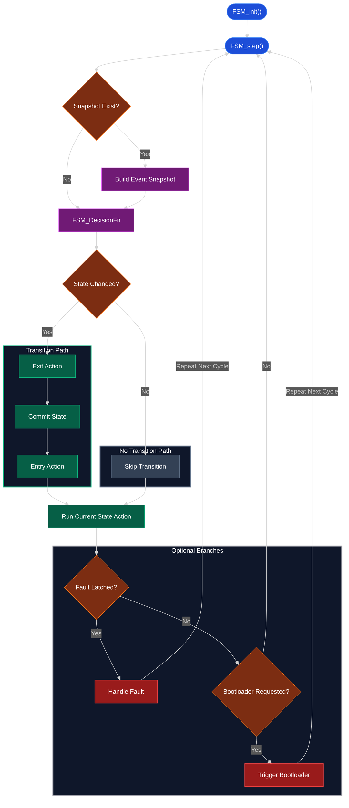

# FSM Driver

## Overview

The FSM driver is a lightweight framework for managing state transitions. You provide three things, the driver handles the rest:

1. **Decision function** — examines the current state and an event snapshot, returns the next state.
2. **Event snapshot builder** — gathers inputs from hardware/CAN/timers into a snapshot struct before each decision.
3. **State config table** — maps each state to optional `entry`, `exit`, and `action` callbacks.

Each cycle (`FSM_step`), the driver:
1. Calls your snapshot builder to gather fresh events
2. Calls your decision function to determine the next state
3. If the state changed: runs the old state's `exit` callback, commits the transition, then runs the new state's `entry` callback
4. Runs the current state's `action` callback (every cycle, regardless of transition)

This keeps the generic engine simple — all application logic lives in your decision function and callbacks.

> [!NOTE]
> The driver also supports cross-FSM communication via `FSM_request_mode_change()`. One FSM can request a state change on another, which the target's decision function can honor on its next cycle. See the ECU example below.

---

## State and Flow Diagram

<details>
<summary>Click to expand FSM cycle diagram</summary>

<div data-zoom="0.9">



</div>

</details>

---

## API Reference

#### `void FSM_init(driver, decide_fn, build_snapshot_fn, state_configs, num_states, initial_state, event_snapshot)`

Initializes the FSM. The `event_snapshot` is a pointer to your application-allocated event struct (cast to `FSM_Event_Snapshot_t`).

#### `uint8_t FSM_step(driver)`

Runs one FSM cycle: build events → decide → transition (if needed) → run action. Returns `1` if a state transition occurred.

#### `FSM_State_t FSM_get_current_state(driver)`

Returns the current state.

#### `FSM_Reason_t FSM_get_last_reason(driver)`

Returns the reason code from the most recent transition.

#### `uint32_t FSM_get_transition_count(driver)`

Returns the total number of transitions since init.

#### `void FSM_set_fault_latch(driver)` / `uint8_t FSM_is_fault_latched(driver)` / `void FSM_reset_fault_latch(driver)`

Permanent fault latch — once set, stays set until explicitly reset (typically only on power cycle). Use this in your decision function to force a fault state.

#### `void FSM_request_bootloader(driver)`

Flags a bootloader request. Your decision function should check `tracking.bootloader_requested` and transition accordingly.

#### `void FSM_request_mode_change(driver, requested_mode, reason)`

Requests a state change from outside the FSM (e.g. from another FSM or a CAN handler). The target FSM's decision function sees `tracking.mode_change_requested` on its next cycle and can honor it.

---

## Integration Pattern

Every board needs two files per FSM:

| File | Contents |
|------|----------|
| `board_fsm.c` | State enum, event snapshot struct, decision function, snapshot builder, init |
| `board_fsm_actions.c` | Entry/exit/action callbacks for each state |

### Setting up an FSM

```c
// 1. Define your states and event snapshot
typedef enum {
    STATE_IDLE, STATE_ACTIVE, STATE_FAULT, STATE_COUNT
} My_State_t;

typedef struct {
    uint8_t sensor_ready;
    uint8_t fault_detected;
} My_Event_Snapshot_t;

// 2. Define your state config table
static FSM_State_Config_t state_configs[STATE_COUNT] = {
    [STATE_IDLE]   = { idle_entry,   NULL, idle_action   },
    [STATE_ACTIVE] = { active_entry, NULL, active_action },
    [STATE_FAULT]  = { fault_entry,  NULL, fault_action  },
};

// 3. Write your decision function
static FSM_State_t decide(FSM_State_t current, const FSM_Event_Snapshot_t *events, FSM_Reason_t *reason) {
    My_Event_Snapshot_t *snap = (My_Event_Snapshot_t *)(*events);

    if (snap->fault_detected) {
        *reason = REASON_FAULT;
        return STATE_FAULT;
    }
    if (current == STATE_IDLE && snap->sensor_ready) {
        *reason = REASON_SENSOR_READY;
        return STATE_ACTIVE;
    }
    return current; // No transition
}

// 4. Init and step
static My_Event_Snapshot_t snapshot;
FSM_Driver_t my_fsm;

void my_fsm_init(void) {
    FSM_init(&my_fsm, decide, build_events, state_configs,
             STATE_COUNT, STATE_IDLE, (FSM_Event_Snapshot_t)&snapshot);
}

// In main loop:
FSM_step(&my_fsm);
```

---

## Example: CAN-Gateway FSM

The CAN-Gateway uses a single FSM that cycles through sensor processing stages:

```
INIT → IDLE → PROCESS_SENSORS → OUTPUT_SENSORS → IDLE → ...
```

<details>
<summary>CAN-Gateway decision logic</summary>

```c
FSM_State_t board_fsm_decide_mode(FSM_State_t current_mode,
    const FSM_Event_Snapshot_t *events, FSM_Reason_t *reason)
{
    if (FSM_is_fault_latched(&board_fsm_driver))
        return BOARD_FSM_MODE_FAULT;

    const Board_FSM_Event_Snapshot_t *snap = (const Board_FSM_Event_Snapshot_t *)(*events);

    if (snap->bootloader_requested) {
        *reason = BOARD_FSM_REASON_BOOTLOADER_REQUEST;
        return BOARD_FSM_MODE_BOOTLOADER;
    }

    switch ((Board_FSM_Mode_t)current_mode) {
        case BOARD_FSM_MODE_INIT:
            *reason = BOARD_FSM_REASON_INIT_COMPLETE;
            return BOARD_FSM_MODE_IDLE;

        case BOARD_FSM_MODE_IDLE:
            if (snap->adc_ready) {
                *reason = BOARD_FSM_REASON_ADC_READY;
                return BOARD_FSM_MODE_PROCESS_SENSORS;
            }
            return BOARD_FSM_MODE_IDLE;

        case BOARD_FSM_MODE_PROCESS_SENSORS:
            *reason = BOARD_FSM_REASON_PROCESS_SENSORS_DONE;
            return BOARD_FSM_MODE_OUTPUT_SENSORS;

        case BOARD_FSM_MODE_OUTPUT_SENSORS:
            *reason = BOARD_FSM_REASON_OUTPUT_SENSORS_COMPLETE;
            return BOARD_FSM_MODE_IDLE;

        default:
            return BOARD_FSM_MODE_FAULT;
    }
}
```

</details>

---

## Example: ECU Hierarchical FSMs

The ECU uses **multiple FSMs** that communicate via `FSM_request_mode_change()`. The main ECU FSM delegates to sub-FSMs for each operating phase:

```
ECU FSM:  IDLE → R2D → CONTROL → SHUTDOWN
                  │        │
                  ▼        ▼
            R2D FSM    Control FSM    Shutdown FSM
```

The key pattern: when the ECU FSM enters a new state, its entry action requests a mode change on the sub-FSM. When the sub-FSM completes, it requests a mode change back on the ECU FSM.

```c
// ECU FSM entry action for R2D state — kicks off the R2D sub-FSM
void ecu_fsm_state_r2d_entry(FSM_State_t state) {
    (void)state;
    ecu_send_software_frame();
    FSM_request_mode_change(&r2d_fsm_driver, SYSTEM_R2D_FIRST_BTN, R2D_FSM_REASON_NONE);
}

// ECU FSM decision function — honors mode change requests from sub-FSMs
static FSM_State_t ecu_fsm_decide(FSM_State_t current_state,
    const FSM_Event_Snapshot_t *events, FSM_Reason_t *reason)
{
    ECU_FSM_Event_Snapshot_t *snap = (ECU_FSM_Event_Snapshot_t *)(*events);
    FSM_State_Tracking_t *tracking = &ecu_fsm_driver.tracking;

    // Safety faults take priority
    if (snap->can_sdc_fault_requested) {
        *reason = ECU_FSM_REASON_FAULT_CAN_SDC;
        FSM_request_mode_change(&shutdown_fsm_driver,
            SYSTEM_SHUTDOWN_START, SHUTDOWN_FSM_REASON_SDC_FAULT);
        return SYSTEM_SHUTDOWN;
    }

    // Honor mode change requests from sub-FSMs
    if (tracking->mode_change_requested) {
        *reason = tracking->mode_change_reason;
        tracking->mode_change_requested = 0U;
        return tracking->mode_change_state;
    }

    return current_state;
}
```

### Main loop

Each FSM is stepped independently. The ECU FSM is the top-level controller; sub-FSMs run inside their parent state's action callback:

```c
// Init all FSMs
r2d_fsm_init();
control_fsm_init();
shutdown_fsm_init();
ecu_fsm_init();

while (1) {
    process_can_frames(&can_driver);
    set_can_frames(&can_driver);
    service_can_tx();

    FSM_step(&ecu_fsm_driver);  // This calls the active state's action,
                                 // which steps the appropriate sub-FSM
}
```
