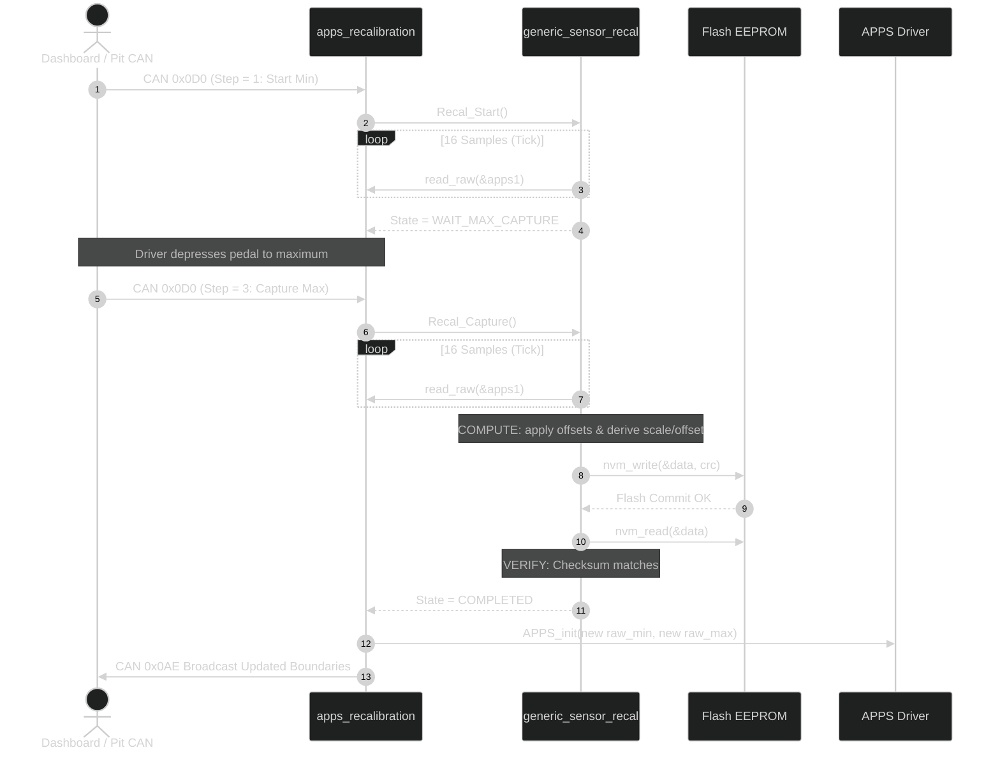

# Sensor Recalibration Integration Guide <Badge type="tip" text="Board Bring-Up" /> <Badge type="info" text="EEPROM Emulation" />

This guide walks through integrating the generic sensor recalibration driver on an embedded target board, using the **CAN-Gateway** implementation (dual <abbr title="Accelerator Pedal Position Sensor">APPS</abbr> and steering angle sensor) as the production reference.

---

## Architecture Overview

On an ARTTU board, the recalibration subsystem coordinates four components:

1. **Hardware Transducers & ADC Buffer**: Continuous analog signals captured by DMA into memory (e.g. `adc2_buffer`).
2. **Generic Recalibration Engine**: Common FSM driver handling filtering, plausibility limits, scaling factors, and CRC32 verification.
3. **Flash EEPROM Emulation**: Persistent flash storage preserving calibrated parameters across MCU resets.
4. **Application Sensor Drivers & Telemetry**: Dynamic updates to active sensor boundaries (`APPS_init`, `steering_sensor_init`) and CAN boundary broadcasting (CAN ID `0x0AE`).

---

## File Structure

A standard board recalibration implementation organizes code as follows:

```
Core/Inc/App/SensorsIO/
└── sensors.h              <- Sensor descriptors, ADC buffer externs, recalibration prototypes

Core/Src/App/SensorsIO/
└── apps_recalibration.c   <- Instance allocation, NVM callbacks, FSM coordination, CAN frame dispatch

Drivers/Flash_EE/
├── ee_config.h            <- Sector allocation and virtual page sizing
├── ee.h                   <- Emulated EEPROM interface (ee_init, ee_read, ee_write)
└── ee.c                   <- Flash page-swapping implementation
```

---

## Step 1: Storage Layout & Configuration (`apps_recalibration.c`)

Define the flash storage struct holding calibration records and allocate static driver instances:

```c
#include "sensors.h"
#include "generic_sensor_recal.h"
#include "adc_buffer.h"
#include "ee.h"
#include <string.h>

// Persistent EEPROM storage payload
typedef struct {
    Recal_Data_t apps_data[2];     // Channel 0: APPS1, Channel 1: APPS2
    Recal_Data_t steering_data;    // Steering angle transducer
} SystemSettings_t;

SystemSettings_t g_settings;

// Static driver instances (one per independent physical channel)
Recal_Instance_t apps_recal_storage[2];
Recal_Instance_t steering_recal_storage;

// Recalibration configurations
static const Recal_Config_t apps_recal_cfg = {
    .sample_window = 16U,   // Average 16 samples per calibration point
    .min_offset    = 100U,  // Deadband margin added to resting minimum
    .max_offset    = 100U   // Deadband margin subtracted from full travel maximum
};

static const Recal_Config_t steering_recal_cfg = {
    .sample_window = 16U,
    .min_offset    = 20U,
    .max_offset    = 20U
};
```

> [!TIP]
> **Deadband Offset Sizing**: For 12-bit ADCs ($0\text{--}4095$ counts), an offset of $50\text{--}100$ counts creates roughly $1.2\%\text{--}2.4\%$ travel margin at the extremes. This prevents physical pedal flex or dirt in the pedal box from preventing the sensor from hitting true zero or $100\%$.

---

## Step 2: Implement Sensor & Storage Callbacks

The driver interfaces with hardware and persistent storage via `Recal_Callbacks_t`.

### ADC Raw Acquisition

Read latest DMA counts using the sensor port index:

```c
uint32_t apps_read_raw(void *context) {
    Generic_Linear_Sensor_t *sensor = (Generic_Linear_Sensor_t *)context;
    return (uint32_t)adc2_buffer[sensor->generic_sensor.port];
}

uint32_t steering_read_raw(void *context) {
    Generic_Linear_Sensor_t *sensor = (Generic_Linear_Sensor_t *)context;
    return (uint32_t)adc2_buffer[sensor->generic_sensor.port];
}
```

### Persistent Storage Callbacks (EEPROM Emulation)

Save and load binary records into the global settings struct and commit to flash:

```c
static int apps_nvm_write(const void *data, size_t len, void *context) {
    if (context == &apps1) {
        memcpy(&g_settings.apps_data[0], data, len);
    } else if (context == &apps2) {
        memcpy(&g_settings.apps_data[1], data, len);
    } else {
        return RECAL_ERR_INVALID_ARG;
    }

    // ee_write flushes the active record to flash page
    return ee_write() ? RECAL_OK : RECAL_ERR_NVM;
}

static int apps_nvm_read(void *data, size_t len, void *context) {
    if (context == &apps1) {
        memcpy(data, &g_settings.apps_data[0], len);
    } else if (context == &apps2) {
        memcpy(data, &g_settings.apps_data[1], len);
    } else {
        return RECAL_ERR_INVALID_ARG;
    }
    return RECAL_OK;
}
```

> [!NOTE]
> The driver automatically computes and verifies a CRC32 checksum across `Recal_Data_t`. Your `nvm_write` and `nvm_read` implementations only need to copy bytes and invoke your storage driver.

---

## Step 3: Boot Sequence & Calibration Loading

At power-on, initialize the EEPROM layer, bind driver instances, and attempt to load stored parameters. If flash is empty or CRC fails, fallback safely to hardcoded factory defaults:

```c
void recalibration_storage_init(void) {
    ee_init(&g_settings, sizeof(g_settings));
    ee_read();
}

void apps_recalibration_init(void) {
    Recal_Callbacks_t cb = {
        .read_raw  = apps_read_raw,
        .nvm_write = apps_nvm_write,
        .nvm_read  = apps_nvm_read,
        .context   = NULL
    };

    // Initialize APPS 1
    cb.context = &apps1;
    Recal_Init(&apps_recal_storage[0], &cb, &apps_recal_cfg);
    if (Recal_LoadFromNvm(&apps_recal_storage[0]) == RECAL_OK) {
        const Recal_Data_t *data0 = Recal_GetData(&apps_recal_storage[0]);
        APPS_init(&apps1, (uint16_t)data0->raw_min, (uint16_t)data0->raw_max,
                  apps1.generic_sensor.port, apps1.generic_sensor.kalman_settings);
    }

    // Initialize APPS 2
    cb.context = &apps2;
    Recal_Init(&apps_recal_storage[1], &cb, &apps_recal_cfg);
    if (Recal_LoadFromNvm(&apps_recal_storage[1]) == RECAL_OK) {
        const Recal_Data_t *data1 = Recal_GetData(&apps_recal_storage[1]);
        APPS_init(&apps2, (uint16_t)data1->raw_min, (uint16_t)data1->raw_max,
                  apps2.generic_sensor.port, apps2.generic_sensor.kalman_settings);
    }

    // Transmit active calibration boundaries over CAN
    send_calibration_values_frame(&can_driver);
}
```

---

## Step 4: Multi-Channel Coordination & Calibration Steps

Because dual-channel sensors like APPS must calibrate in lockstep, use a state-step handler triggered by incoming CAN messages (e.g. CAN ID `0x0D0` from the dashboard or telemetry):

```c
void recalibration_handler(uint8_t *step, Recal_Instance_t *instance) {
    if (step == NULL || instance == NULL || *step == 0U) {
        return;
    }

    if (*step == 1U) {
        // Step 1: Start sequence (sampling resting minimum)
        Recal_Abort(instance);
        int rc = Recal_Start(instance);
        *step = (rc == RECAL_OK) ? 2U : 0U;
    } else if (*step == 3U) {
        // Step 3: Trigger capture of peak travel maximum
        Recal_State_t state = Recal_GetState(instance);
        if (state == RECAL_STATE_WAIT_MAX_CAPTURE) {
            int rc = Recal_Capture(instance);
            *step = (rc == RECAL_OK) ? 0U : 2U;
        } else {
            *step = 2U;
        }
    }
}
```

### Recalibration Workflow

| Step Value | User Action | Driver State | Result |
| :---: | :--- | :--- | :--- |
| `1` | Pedals/Wheel at physical rest | `MEASURE_MIN_SAMPLING` | Averages min window; transitions to `WAIT_MAX_CAPTURE` (Step updates to `2`) |
| `2` | Driver depresses pedal fully | `WAIT_MAX_CAPTURE` | Holds until user signals capture command |
| `3` | User triggers capture | `MEASURE_MAX_SAMPLING` | Averages max window, runs `COMPUTE`, `STORE`, and `VERIFY` (Step resets to `0`) |

---

## Step 5: Periodic Execution & Value Committal

In your periodic sensor task or main loop, step the calibration instances via `Recal_Tick()`. When instances conclude, commit the new calibration parameters to the running sensor drivers:

```c
static void apps_apply_if_ready(void) {
    // Only commit if BOTH dual channels succeeded
    if (Recal_GetState(&apps_recal_storage[0]) != RECAL_STATE_COMPLETED ||
        Recal_GetState(&apps_recal_storage[1]) != RECAL_STATE_COMPLETED) {
        return;
    }

    const Recal_Data_t *data0 = Recal_GetData(&apps_recal_storage[0]);
    const Recal_Data_t *data1 = Recal_GetData(&apps_recal_storage[1]);

    if (data0 != NULL && data1 != NULL) {
        // Re-initialize active sensors with newly computed physical boundaries
        APPS_init(&apps1, (uint16_t)data0->raw_min, (uint16_t)data0->raw_max,
                  apps1.generic_sensor.port, apps1.generic_sensor.kalman_settings);
        APPS_init(&apps2, (uint16_t)data1->raw_min, (uint16_t)data1->raw_max,
                  apps2.generic_sensor.port, apps2.generic_sensor.kalman_settings);
    }

    // Reset instances back to IDLE
    Recal_Abort(&apps_recal_storage[0]);
    Recal_Abort(&apps_recal_storage[1]);

    // Broadcast updated boundaries across CAN network (0x0AE)
    send_calibration_values_frame(&can_driver);
}

void apps_recalibration_tick(uint32_t dt_ms) {
    Recal_Tick(&apps_recal_storage[0], dt_ms);
    Recal_Tick(&apps_recal_storage[1], dt_ms);
    apps_apply_if_ready();
}
```

---

## Step 6: Board Integration Sequence Diagram

<div data-zoom="0.95">



</div>

---

## Common Implementation Issues & Troubleshooting

| Issue | Symptom | Root Cause | Solution |
| :--- | :--- | :--- | :--- |
| **Virgin Flash CRC Mismatch** | Boot defaults to compile-time fallback limits | Unprogrammed flash contains all `0xFF`, failing CRC check | Expected on first flash; run on-car calibration once to write valid record |
| **Inverted Limits (`RECAL_ERR_PLAUSIBLE`)** | State transitions to `RECAL_STATE_ERROR` during `COMPUTE` | Sensor was pressed during min capture or released during max capture ($max \le min$) | Verify user follows step prompt: release pedals for Step 1, floor pedals for Step 3 |
| **Deadband Offset Underflow** | `RECAL_ERR_PLAUSIBLE` error code | `max_offset` is larger than measured raw maximum | Verify sensor wiring and ensure ADC readings span at least several hundred counts |
| **Calibration Never Finishes** | State stuck in `MEASURE_MIN_SAMPLING` or `MEASURE_MAX_SAMPLING` | `Recal_Tick()` is not being called periodically from the main loop | Ensure `apps_recalibration_tick()` is placed in the cyclic sensor processing task |
| **Flash Write Failure (`RECAL_ERR_NVM`)** | State transitions to `RECAL_STATE_ERROR` during `STORE` | Flash page full, write protection enabled, or interrupt collision during erase/program | Verify flash sector allocation in `ee_config.h` and ensure interrupts are masked during write |
| **Pedal Values Jitter at 0%** | Raw throttle blips between 0% and 1% at rest | `min_offset` is set too low relative to electrical ADC noise | Increase `min_offset` in `Recal_Config_t` (e.g. from 20 to 100 counts) |
