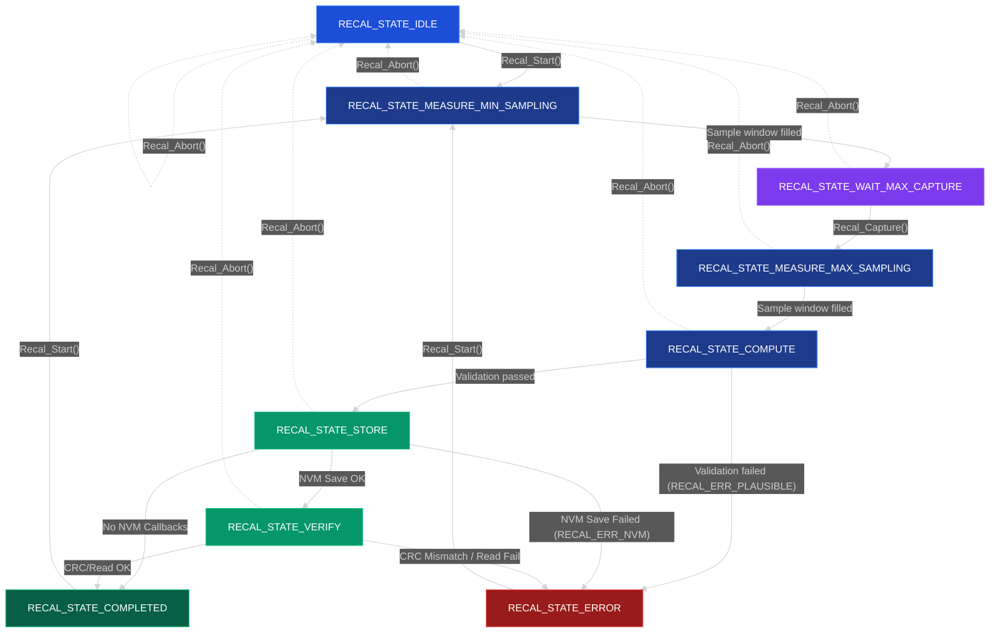

# Sensor Recalibration <Badge type="info" text="FSM-Driven" /> <Badge type="tip" text="NVM-Ready" />

## Overview

The generic sensor recalibration driver provides a hardware-agnostic, state-driven framework for performing **two-point linear calibration** on continuous analog sensors, such as Accelerator Pedal Position Sensors (<abbr title="Accelerator Pedal Position Sensor">APPS</abbr>), brake pressure transducers, and steering angle potentiometers.

Key capabilities include:
- **Two-Point Calibration**: Samples and derives linear scaling parameters ($scale$ and $offset$) to map raw ADC counts to a normalized $0.0$ to $1.0$ float domain.
- **Deadband Offset Compensation**: Configurable minimum and maximum offsets create physical margin, eliminating boundary jitter at $0\%$ and $100\%$.
- **Automated Sample Averaging**: Collects sliding sample windows to reject transient electrical noise during calibration points.
- **Plausibility Verification**: Validates span integrity, range boundaries, and sensor inversion prior to committing parameters.
- **Non-Volatile Persistence & CRC Integrity**: Persists calibration payloads to flash/EEPROM with CRC32 verification on both save and load operations.
- **Decoupled Architecture**: Fully decoupled from hardware peripherals via function pointer callbacks (`read_raw`, `nvm_write`, `nvm_read`).

> [!TIP]
> See the [Sensor Recalibration Integration Guide](/shared/common/modules/drivers/recalibration-integration) for a step-by-step walkthrough of integrating this driver on a board with Flash EEPROM emulation, using the CAN-Gateway dual APPS and steering setup as a reference.

### Source Files

- Header: `repos/common/drivers/sensors/recalibration/generic_sensor_recal.h`
- Implementation: `repos/common/drivers/sensors/recalibration/generic_sensor_recal.c`
- Unit Tests: `repos/common/test/drivers/Sensors/test_generic_sensor_recal.c`

---

## Architectural Flow

The recalibration sequence operates via a cooperative finite state machine triggered by host commands (such as a dashboard push-button or a diagnostic CAN message):

```mermaid
%%{init: {
  'theme': 'dark',
  'themeVariables': {
    'fontSize': '14px',
    'fontFamily': 'system-ui, sans-serif'
  },
  'flowchart': {
    'nodeSpacing': 20,
    'rankSpacing': 30,
    'padding': 15,
    'curve': 'basis'
  }
}}%%
flowchart TB
    classDef hostTrigger fill:#065f46,stroke:#10b981,stroke-width:2px,color:#fff;
    classDef fsmState fill:#1e3a8a,stroke:#3b82f6,stroke-width:1px,color:#fff;
    classDef actionNode fill:#334155,stroke:#64748b,stroke-width:1px,color:#fff;
    classDef storageNode fill:#7c2d12,stroke:#f97316,stroke-width:1px,color:#fff;
    classDef completeNode fill:#065f46,stroke:#10b981,stroke-width:2px,color:#fff;
    classDef userNode fill:#581c87,stroke:#a855f7,stroke-width:1px,color:#fff;

    subgraph Phase1 ["Phase 1: Minimum Position Calibration"]
        direction TB
        trig_min["Host Command: CAN 0x0D0 / Button (Step 1)"]:::hostTrigger
        call_start["Recal_Start()"]:::fsmState
        state_min["State: MEASURE_MIN_SAMPLING"]:::fsmState
        sample_min["Accumulate N samples via read_raw()<br/>Average baseline minimum"]:::actionNode
        state_wait["State: WAIT_MAX_CAPTURE"]:::fsmState

        trig_min --> call_start --> state_min --> sample_min --> state_wait
    end

    subgraph Phase2 ["Phase 2: Maximum Position Calibration"]
        direction TB
        user_move["Driver depresses pedal to maximum travel"]:::userNode
        trig_max["Host Command: CAN 0x0D0 / Button (Step 3)"]:::hostTrigger
        call_cap["Recal_Capture()"]:::fsmState
        state_max["State: MEASURE_MAX_SAMPLING"]:::fsmState
        sample_max["Accumulate N samples via read_raw()<br/>Average peak maximum"]:::actionNode

        user_move --> trig_max --> call_cap --> state_max --> sample_max
    end

    subgraph Phase3 ["Phase 3: Computation & NVM Persistence"]
        direction TB
        state_comp["State: COMPUTE<br/>Apply deadband offsets & plausibility check<br/>Compute scale & offset constants"]:::actionNode
        state_store["State: STORE<br/>Calculate CRC32 checksum & invoke nvm_write()"]:::storageNode
        state_verify["State: VERIFY<br/>Read back via nvm_read() & verify CRC32"]:::storageNode
        state_done["State: COMPLETED"]:::completeNode

        state_comp --> state_store --> state_verify --> state_done
    end

    subgraph Phase4 ["Phase 4: Sensor Deployment & Telemetry"]
        direction TB
        apply_sensor["Update Active Sensor Drivers<br/>(APPS_init / steering_sensor_init)"]:::actionNode
        tx_telemetry["Broadcast New Boundaries on CAN<br/>(CAN ID 0x0AE)"]:::hostTrigger

        apply_sensor --> tx_telemetry
    end

    state_wait ==> user_move
    sample_max ==> state_comp
    state_done ==> apply_sensor

    style Phase1 fill:#0f172a,stroke:#10b981,stroke-width:1px,color:#fff
    style Phase2 fill:#0f172a,stroke:#a855f7,stroke-width:1px,color:#fff
    style Phase3 fill:#0f172a,stroke:#3b82f6,stroke-width:1px,color:#fff
    style Phase4 fill:#0f172a,stroke:#f59e0b,stroke-width:1px,color:#fff
```

<div data-zoom="0.95">



</div>

---

## Mathematical Model

The driver maps raw ADC counts or digital sensor levels to a normalized floating-point range $[0.0, 1.0]$ representing $0\%$ to $100\%$ actuation.

### 1. Deadzone Offsets
Mechanical linkages and pedal boxes exhibit mechanical tolerance and resting noise. To ensure that resting pedals reliably register $0.0$ and fully depressed pedals reliably register $1.0$, configurable deadzone offsets are applied to the raw averaged readings:

$$adjusted\_min = measured\_min + min\_offset$$

$$adjusted\_max = measured\_max - max\_offset$$

### 2. Plausibility Sanity Checks
Before computing calibration factors, the driver evaluates the adjusted boundaries:

$$\begin{cases}
adjusted\_max > max\_offset & \text{(Underflow guard)} \\
adjusted\_max > adjusted\_min & \text{(Positive span requirement)}
\end{cases}$$

If either condition fails, the driver aborts the sequence, sets `last_error = RECAL_ERR_PLAUSIBLE`, and transitions immediately to `RECAL_STATE_ERROR`.

> [!NOTE]
> **Sensor Gradient & Monotonicity**: The calibration model assumes a positive gradient ($adjusted\_max > adjusted\_min$). If your physical sensor exhibits an inverted characteristic (e.g. higher throttle angle produces a lower analog voltage), invert the count inside your application's `read_raw` callback (e.g. `4095U - raw_adc`) before returning it to the recalibration engine.

### 3. Scaling Parameter Derivation
When boundaries are validated, the linear transformation constants are calculated:

$$denom = (float)(adjusted\_max - adjusted\_min)$$

$$scale = \frac{1.0}{denom}$$

$$offset = -(float)(adjusted\_min) \times scale$$

### 4. Runtime Sensor Normalization
Once calibrated parameters are committed, the consumer sensor driver maps subsequent real-time samples using:

$$calibrated\_value = (raw\_value \times scale) + offset$$

This guarantees:
- When $raw\_value = adjusted\_min$, $calibrated\_value = 0.0$
- When $raw\_value = adjusted\_max$, $calibrated\_value = 1.0$

---

## Key Data Types & Structs

### `Recal_Config_t`
Runtime configuration parameters supplied during instance initialization:

```c
typedef struct {
    uint32_t sample_window; // Number of samples to average (default: 16)
    uint16_t min_offset;    // Counts added to raw min to establish zero deadband
    uint16_t max_offset;    // Counts subtracted from raw max to establish 100% deadband
} Recal_Config_t;
```

### `Recal_Callbacks_t`
Hardware abstraction hooks for analog acquisition and non-volatile memory storage:

```c
typedef struct {
    uint32_t (*read_raw)(void *context);
    int (*nvm_write)(const void *data, size_t len, void *context);
    int (*nvm_read)(void *data, size_t len, void *context);
    void *context;
} Recal_Callbacks_t;
```

| Member | Purpose |
| :--- | :--- |
| `read_raw` | Returns latest raw sensor reading (e.g. DMA-backed ADC count). Mandatory. |
| `nvm_write` | Persists calibration binary payload to storage. Returns 0 on success. Optional. |
| `nvm_read` | Retrieves calibration binary payload from storage. Returns 0 on success. Optional. |
| `context` | Opaque caller handle passed back to callbacks (e.g. sensor descriptor). |

### `Recal_Data_t`
The persistent calibration record layout saved to NVM:

```c
typedef struct {
    uint16_t version;    // Layout version (defaults to 1)
    float offset;        // Calculated offset multiplier
    float scale;         // Calculated scale multiplier
    uint32_t raw_min;    // Adjusted raw minimum reference count
    uint32_t raw_max;    // Adjusted raw maximum reference count
    uint32_t crc;        // CRC32 of all preceding structure fields
} Recal_Data_t;
```

### `Recal_Instance_t`
Main state and working storage container. Allocated by the application (statically or dynamically):

| Member | Type | Description |
| :--- | :--- | :--- |
| `cb` | `Recal_Callbacks_t` | Configured hardware and NVM callbacks |
| `data` | `Recal_Data_t` | Computed calibration parameters and stored CRC |
| `state` | `Recal_State_t` | Current FSM operational state |
| `sample_window` | `uint32_t` | Window sample depth |
| `min_offset` | `uint16_t` | Applied minimum deadband margin |
| `max_offset` | `uint16_t` | Applied maximum deadband margin |
| `sample_acc` | `uint64_t` | Internal 64-bit sample accumulator |
| `sample_count` | `uint32_t` | Count of collected samples in current window |
| `have_min` | `bool` | Flag indicating min sampling step completion |
| `measured_min` | `uint32_t` | Raw averaged minimum measurement |
| `measured_max` | `uint32_t` | Raw averaged maximum measurement |
| `last_error` | `int` | Status code from the most recent operation |

---

## Status & Error Codes

| Code | Value | Meaning |
| :--- | :--- | :--- |
| `RECAL_OK` | `0` | Operation succeeded without errors |
| `RECAL_ERR_NOT_STARTED` | `-1` | Operation called before calibration sequence began |
| `RECAL_ERR_INVALID_ARG` | `-2` | Null pointer passed or sequence called from invalid state |
| `RECAL_ERR_PLAUSIBLE` | `-3` | Inverted limits or span smaller than offsets ($max \le min$) |
| `RECAL_ERR_NVM` | `-4` | Storage write/read failure or CRC32 checksum mismatch |

---

## API Reference

#### `Recal_Instance_t *Recal_Init(inst, cb, config)`

Initializes the instance, clears working accumulators, assigns callbacks, and resets state to `RECAL_STATE_IDLE`.

```c
Recal_Instance_t *Recal_Init(Recal_Instance_t *inst,
                             Recal_Callbacks_t const *cb,
                             Recal_Config_t const *config);
```

| Parameter | Type | Description |
| :--- | :--- | :--- |
| `inst` | `Recal_Instance_t*` | Pointer to caller-allocated instance |
| `cb` | `const Recal_Callbacks_t*` | Populated callback hooks (`read_raw` must be non-NULL) |
| `config` | `const Recal_Config_t*` | Configuration parameters (`sample_window`, offsets) |

Returns pointer to `inst` on success, or `NULL` if mandatory parameters are missing.

#### `int Recal_Start(inst)`

Initiates a new calibration sequence. Valid only when in `RECAL_STATE_IDLE` or `RECAL_STATE_COMPLETED`. Resets internal accumulators and transitions to `RECAL_STATE_MEASURE_MIN_SAMPLING`.

Returns `RECAL_OK` (`0`) on success, or `RECAL_ERR_INVALID_ARG` (`-2`) on invalid state.

#### `int Recal_Capture(inst)`

Signals the driver that the physical sensor is at its maximum travel point. Valid only when in `RECAL_STATE_WAIT_MAX_CAPTURE`. Transitions state to `RECAL_STATE_MEASURE_MAX_SAMPLING`.

Returns `RECAL_OK` on success, or `RECAL_ERR_INVALID_ARG` if called outside `WAIT_MAX_CAPTURE`.

#### `int Recal_Abort(inst)`

Immediately aborts any active calibration sequence and forces the state machine back to `RECAL_STATE_IDLE`. Safe to call from any state.

#### `void Recal_Tick(inst, dt_ms)`

Steps the calibration state machine. Must be invoked periodically from a task, timer interrupt, or cooperative main loop:
- In sampling states: polls `read_raw()`, accumulates samples, and averages them when window is reached.
- In `COMPUTE`: computes offsets, scale, and performs plausibility checks.
- In `STORE`: invokes `nvm_write` with calculated CRC32. If no NVM callbacks exist, proceeds directly to `COMPLETED`.
- In `VERIFY`: invokes `nvm_read` and matches CRC32 checksum.

> [!WARNING]
> **Execution Context & NVM Blocking**: If your application supplies persistent `nvm_write` or `nvm_read` callbacks that perform blocking flash operations or sector page-swapping (e.g. Flash EEPROM emulation), `Recal_Tick()` **must** be executed from a main-loop or thread task context, not inside a high-priority hardware ISR or SysTick handler.

#### `Recal_State_t Recal_GetState(inst)`

Returns the active operational state of the calibration instance.

#### `const Recal_Data_t *Recal_GetData(inst)`

Returns a pointer to the computed `Recal_Data_t` structure. Valid after reaching `RECAL_STATE_COMPLETED`.

#### `int Recal_SaveToNvm(inst)`

Manually computes CRC32 over calibration fields and flushes `inst->data` to storage using the configured `nvm_write` callback. Returns `0` on success, or `RECAL_ERR_NVM` on failure.

#### `int Recal_LoadFromNvm(inst)`

Manually reads calibration data from storage using the `nvm_read` callback and validates the CRC32 checksum. If valid, updates `inst->data` and returns `0`. Returns `RECAL_ERR_NVM` if the read fails or CRC is corrupted.

---

## State Machine & Flow Diagram

<div data-zoom="0.95">



</div>

### State Descriptions

| State | Description | Next Trigger / Target |
| :--- | :--- | :--- |
| `RECAL_STATE_IDLE` | Quiescent state; calibration inactive | `Recal_Start()` $\rightarrow$ `MEASURE_MIN_SAMPLING` |
| `RECAL_STATE_MEASURE_MIN_SAMPLING` | Samples and averages baseline resting position | Window full $\rightarrow$ `WAIT_MAX_CAPTURE` |
| `RECAL_STATE_WAIT_MAX_CAPTURE` | Holds and waits for physical actuation to peak | `Recal_Capture()` $\rightarrow$ `MEASURE_MAX_SAMPLING` |
| `RECAL_STATE_MEASURE_MAX_SAMPLING` | Samples and averages peak travel position | Window full $\rightarrow$ `COMPUTE` |
| `RECAL_STATE_COMPUTE` | Applies deadbands, validates plausibility, computes $scale$ and $offset$ | Pass $\rightarrow$ `STORE`, Fail $\rightarrow$ `ERROR` |
| `RECAL_STATE_STORE` | Computes CRC32 and invokes `nvm_write` callback | Success $\rightarrow$ `VERIFY`, No NVM $\rightarrow$ `COMPLETED` |
| `RECAL_STATE_VERIFY` | Reads back via `nvm_read` and verifies CRC integrity | Match $\rightarrow$ `COMPLETED`, Mismatch $\rightarrow$ `ERROR` |
| `RECAL_STATE_COMPLETED` | Sequence succeeded; calibration parameters ready | `Recal_GetData()` to retrieve parameters |
| `RECAL_STATE_ERROR` | Plausibility failure or NVM write/CRC verification fault | Re-trigger via `Recal_Start()` or reset via `Recal_Abort()` |
