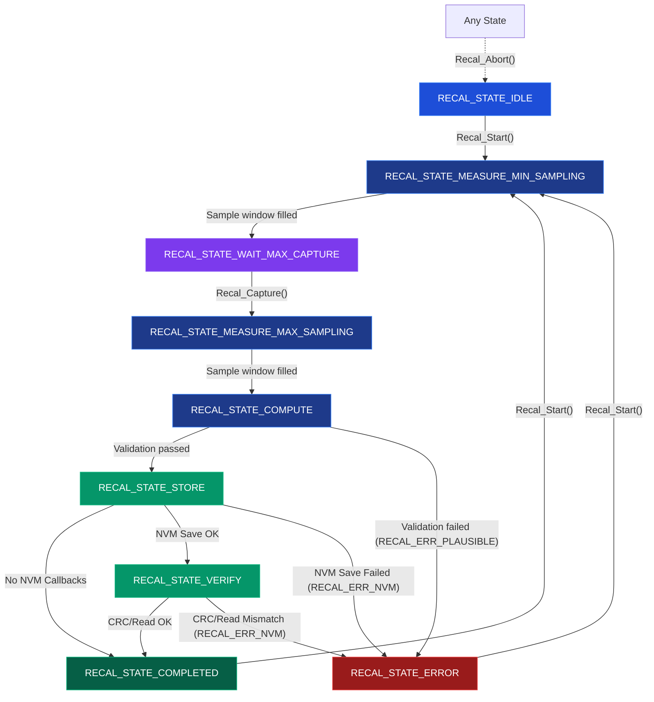

# Sensor Recalibration

The generic sensor recalibration driver provides a reusable, state-driven interface for performing **two-point linear calibration** on analog or continuous sensors (such as APPS pedals or steering angle sensors). It handles sample averaging, noise deadzone offsets, validity checks, and optional non-volatile memory (NVM) storage with CRC32 verification.

The driver files are located at:
- [repos/common/drivers/sensors/recalibration/generic_sensor_recal.c](repos/common/drivers/sensors/recalibration/generic_sensor_recal.c)
- [repos/common/drivers/sensors/recalibration/generic_sensor_recal.h](repos/common/drivers/sensors/recalibration/generic_sensor_recal.h)
- Unit tests: [repos/common/test/drivers/Sensors/test_generic_sensor_recal.c](repos/common/test/drivers/Sensors/test_generic_sensor_recal.c)

---

## State Machine (FSM)

The recalibration sequence operates as a finite state machine. A calibration pass starts by measuring the sensor's minimum position, waiting for user confirmation, measuring the maximum position, calculating scaling parameters, and storing/verifying them in persistent memory.

<div data-zoom="0.95">



</div>

### Recalibration States:
- **`RECAL_STATE_IDLE`**: Default resting state. No calibration is active.
- **`RECAL_STATE_MEASURE_MIN_SAMPLING`**: Captures raw samples via the read callback up to `sample_window` and averages them to establish the baseline minimum.
- **`RECAL_STATE_WAIT_MAX_CAPTURE`**: Halts and waits for the user to position the physical sensor at its maximum extent and trigger `Recal_Capture()`.
- **`RECAL_STATE_MEASURE_MAX_SAMPLING`**: Captures raw samples up to `sample_window` and averages them to establish the baseline maximum.
- **`RECAL_STATE_COMPUTE`**: Runs plausibility checks, applies offsets, and computes the floating-point `scale` and `offset` constants.
- **`RECAL_STATE_STORE`**: Attempts to write the calibration payload to non-volatile memory via callbacks.
- **`RECAL_STATE_VERIFY`**: Reads back the NVM payload and performs a CRC checksum match to confirm write integrity.
- **`RECAL_STATE_COMPLETED`**: Calibration successfully concluded; new parameters are ready for sensor applications.
- **`RECAL_STATE_ERROR`**: Transitioned to when NVM storage fails or sensor limits fail plausibility validation.

---

## Mathematical Model

The driver maps raw sensor voltages/ADC values to a normalized float range between $0.0$ ($0\%$) and $1.0$ ($100\%$).

### 1. Adjusting Raw Limits with Deadzones
To prevent the calibrated output from flickering at $0\%$ or $100\%$ due to physical sensor noise or mechanical misalignment, the configuration allows defining min and max deadzone offsets:
$$adjusted\_min = measured\_min + min\_offset$$
$$adjusted\_max = measured\_max - max\_offset$$

### 2. Parameter Calculation
Once limits are adjusted, the driver performs two sanity checks:
- $adjusted\_max > max\_offset$
- $adjusted\_max > adjusted\_min$

If these pass, it computes the scaling factors:
$$denom = adjusted\_max - adjusted\_min$$
$$scale = \frac{1.0}{denom}$$
$$offset = -adjusted\_min \times scale$$

### 3. Normalization Formula
At runtime, the sensor driver converts any raw ADC input to a calibrated percentage using:
$$calibrated\_value = raw\_value \times scale + offset$$

This maps $raw\_value = adjusted\_min$ to $0.0$, and $raw\_value = adjusted\_max$ to $1.0$.

---

## Struct Definitions

### 1. `Recal_Config_t`
Defines parameters for starting a calibration sequence.
```c
typedef struct {
    uint32_t sample_window; // Number of samples to average (default: 16)
    uint16_t min_offset;    // Baseline count added to measured minimum
    uint16_t max_offset;    // Baseline count subtracted from measured maximum
} Recal_Config_t;
```

### 2. `Recal_Callbacks_t`
Provides interface functions to interact with the underlying hardware and storage layer.
```c
typedef struct {
    // Read raw ADC/sensor sample callback
    uint32_t (*read_raw)(void *context);

    // Persistent storage hooks (return 0 on success, negative on error)
    int (*nvm_write)(const void *data, size_t len, void *context);
    int (*nvm_read)(void *data, size_t len, void *context);

    void *context; // User context pointer forwarded to callbacks
} Recal_Callbacks_t;
```

### 3. `Recal_Data_t`
The compiled calibration structure stored persistently in flash.
```c
typedef struct {
    uint16_t version;    // Layout version (defaults to 1)
    float offset;        // Calculated offset multiplier
    float scale;         // Calculated scale multiplier
    uint32_t raw_min;    // Final adjusted raw min limit
    uint32_t raw_max;    // Final adjusted raw max limit
    uint32_t crc;        // CRC32 checksum (calculated over all preceding fields)
} Recal_Data_t;
```

---

## API Function Reference

#### `Recal_Instance_t *Recal_Init(Recal_Instance_t *inst, Recal_Callbacks_t const *cb, Recal_Config_t const *config)`
Initializes the calibration instance with callbacks, config parameters, and sets the initial state to `RECAL_STATE_IDLE`.

#### `int Recal_Start(Recal_Instance_t *inst)`
Resets sample buffers and starts a new calibration process, moving the state to `RECAL_STATE_MEASURE_MIN_SAMPLING`. Returns `RECAL_OK` on success, or `RECAL_ERR_INVALID_ARG` if already calibrating.

#### `int Recal_Capture(Recal_Instance_t *inst)`
Signals the FSM to transition from `RECAL_STATE_WAIT_MAX_CAPTURE` to `RECAL_STATE_MEASURE_MAX_SAMPLING` (starts capturing high samples).

#### `int Recal_Abort(Recal_Instance_t *inst)`
Immediately aborts any active sequence and returns the state machine to `RECAL_STATE_IDLE`.

#### `void Recal_Tick(Recal_Instance_t *inst, uint32_t dt_ms)`
Updates the calibration step. Must be called periodically from a timer, main loop, or task runner. The parameter `dt_ms` passes elapsed time.

#### `const Recal_Data_t *Recal_GetData(Recal_Instance_t *inst)`
Returns a pointer to the computed calibration factors inside `Recal_Data_t`. Valid after entering `RECAL_STATE_COMPLETED`.

#### `int Recal_SaveToNvm(Recal_Instance_t *inst)`
Computes the CRC32 checksum over the current calibration struct fields and executes the `nvm_write` callback.

#### `int Recal_LoadFromNvm(Recal_Instance_t *inst)`
Invokes the `nvm_read` callback, computes the CRC32 checksum over the retrieved fields, and compares it with the read `crc` field. Returns `0` on validation success, or `RECAL_ERR_NVM` on error or CRC mismatch.

---

## Usage Example

Below is a complete implementation integrating the generic driver with a mock sensor and simulated flash storage:

```c
#include "generic_sensor_recal.h"
#include <stdio.h>

// Simulated flash page in RAM
static uint8_t mock_flash_page[128];

static uint32_t dummy_read_raw(void *context) {
    uint32_t *hardware_adc = (uint32_t *)context;
    return *hardware_adc;
}

static int dummy_nvm_write(const void *data, size_t len, void *context) {
    if (len > sizeof(mock_flash_page)) return -1;
    memcpy(mock_flash_page, data, len);
    return 0;
}

static int dummy_nvm_read(void *data, size_t len, void *context) {
    if (len > sizeof(mock_flash_page)) return -1;
    memcpy(data, mock_flash_page, len);
    return 0;
}

void execute_recalibration(void) {
    uint32_t adc_sensor_reading = 200U; // Start at minimum sensor position
    
    Recal_Instance_t inst;
    Recal_Callbacks_t cb = {
        .read_raw = dummy_read_raw,
        .nvm_write = dummy_nvm_write,
        .nvm_read = dummy_nvm_read,
        .context = &adc_sensor_reading
    };
    
    Recal_Config_t cfg = {
        .sample_window = 4U, // Sample 4 ticks for min and max
        .min_offset = 10U,
        .max_offset = 10U
    };

    // Initialize calibration instance
    Recal_Init(&inst, &cb, &cfg);

    // Step 1: Start Calibration (sampling min)
    Recal_Start(&inst);
    for (int i = 0; i < 4; i++) {
        Recal_Tick(&inst, 10U);
    }

    // Now state is RECAL_STATE_WAIT_MAX_CAPTURE
    // Step 2: Set raw to max position and capture
    adc_sensor_reading = 3800U;
    Recal_Capture(&inst);

    // Step 3: Tick to sample max
    for (int i = 0; i < 4; i++) {
        Recal_Tick(&inst, 10U);
    }

    // Step 4: Tick to run COMPUTE and NVM STORE/VERIFY steps
    Recal_Tick(&inst, 10U); // COMPUTE -> STORE
    Recal_Tick(&inst, 10U); // STORE -> VERIFY
    Recal_Tick(&inst, 10U); // VERIFY -> COMPLETED

    if (Recal_GetState(&inst) == RECAL_STATE_COMPLETED) {
        const Recal_Data_t *data = Recal_GetData(&inst);
        printf("Calibration Complete! Min Raw: %lu, Max Raw: %lu\n", data->raw_min, data->raw_max);
        printf("Computed Scale: %f, Offset: %f\n", data->scale, data->offset);
    }
}
```

